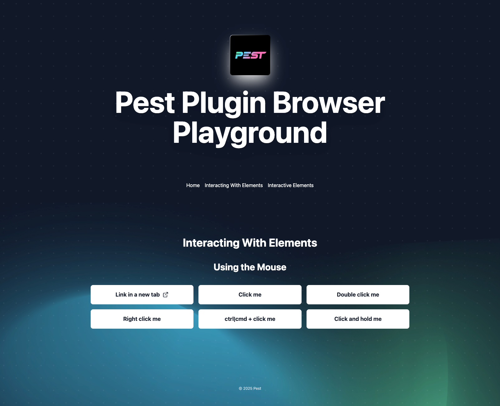

# Pest Plugin Browser

This repository contains the Pest Plugin Browser.

> If you want to start testing your application with Pest, visit the main **[Pest Repository](https://github.com/pestphp/pest)**.


## Community & Resources

- Explore our docs at **[pestphp.com »](https://pestphp.com)**
- Follow us on Twitter at **[@pestphp »](https://twitter.com/pestphp)**
- Join us at **[discord.gg/kaHY6p54JH »](https://discord.gg/kaHY6p54JH)** or **[t.me/+kYH5G4d5MV83ODk0 »](https://t.me/+kYH5G4d5MV83ODk0)**
- Follow the creator Nuno Maduro:
    - YouTube: **[youtube.com/@nunomaduro](https://www.youtube.com/@nunomaduro)** — Videos every weekday
    - Twitch: **[twitch.tv/enunomaduro](https://www.twitch.tv/enunomaduro)** — Streams (almost) every weekday
    - Twitter / X: **[x.com/enunomaduro](https://x.com/enunomaduro)**
    - LinkedIn: **[linkedin.com/in/nunomaduro](https://www.linkedin.com/in/nunomaduro)**
    - Instagram: **[instagram.com/enunomaduro](https://www.instagram.com/enunomaduro)**
    - Tiktok: **[tiktok.com/@enunomaduro](https://www.tiktok.com/@enunomaduro)**

## Installation (for development purposes)

1. Install PHP dependencies using Composer:

```bash
composer install
```

2. Install Node.js dependencies:

```bash
npm install
```

3. Install Playwright browsers:

```bash
npx playwright install
```

## Running Tests

To run the test suite, execute:

```bash
./vendor/bin/pest
```

## The Playground



For each Operation/Assertion, we add a corresponding Test.

We can make use of the `playgroundUrl()` helper, to get its URL during the test.

We can provide a URI that will be appended, e.g: `playgroundUrl('/test/interactive-elements')`.

Attention: we can use `->visit('/foo')`, using the base URL, without the helper.

The helper exists for assertion scenarios, like:

```php
$this->visit('/test/interactive-elements')
    ->assertUrlIs(playgroundUrl('/test/interactive-elements'))
```

### Routes and views for testing

Check the `playground/resources/views/test-pages` folder for existing views.

They are accessible by the playground route `/test/{page}`.

E.g.: The view `resources/views/test-pages/interactive-elements.blade.php` is visited
on `playgroundUrl('/test/interactive-elements')`.

The playground is standard Laravel App, where you may add a page with a feature for your test.

Just add the view, and the Nav Menu will automatically update based on the view name.

## License

Pest is an open-sourced software licensed under the **[MIT license](https://opensource.org/licenses/MIT)**.

# Documentation

Pest Plugin Browser brings end-to-end testing to the elegant syntax from Pest.
This allows to test your application in a browser environment, enabling to test all the components, such as frontend,
backend and database.

## Installation

TBD

## Available Operations

- [back](#back)
- [click](#click)
- [clickAndHold](#clickAndHold)
- [clickAtPoint](#clickAtPoint)
- [clickAtXPath](#clickAtXPath)
- [clickLink](#clickLink)
- [controlClick](#controlClick)
- [doubleClick](#doubleClick)
- [forward](#forward)
- [pause](#pause)
- [setTimeout](#setTimeout)
- [refresh](#refresh)
- [rightClick](#rightClick)
- [when](#when)
- [screenshot](#screenshot)
- [visit](#visit)
- [check](#check)
- [uncheck](#uncheck)
- [type](#type)
- [append](#append)
- [clear](#clear)

### Checkboxes

Check the given element.

```php
$this->visit($url)
    ->check('#checkbox-unchecked');
```

Uncheck the given element.

```php
$this->visit($url)
    ->uncheck('#checkbox-checked');
```

### click

Click the element at the given selector.

```php
$this->click('.selector');
```

### clickAndHold

Perform a mouse click and hold the mouse button down at the given selector.

```php
$this->clickAndHold('.selector');
```

### clickAtPoint

Click the topmost element at the given pair of coordinates.

```php
$this->clickAtPoint('//div[@class = "selector"]');
```

### clickAtXPath

Click the element at the given XPath expression.

```php
$this->clickAtXPath('//div[@class = "selector"]');
```

### clickLink

Clicks some text on the page.

```php
$this->clickLink('Sign In');
```

### controlClick

Control click the element at the given selector.

```php
$this->controlClick('.selector');
```

### doubleClick

Double-click the element at the given selector.

```php
$this->doubleClick('.selector');
```

### Navigate back

Go back one page from the browser history.

```php
$this->back();
```

### Navigate forward

Go forward one page from the browser history.

```php
$this->forward();
```

### pause

Pauses the execution for a specified number of milliseconds.

> [!WARNING]
> Discouraged: Never pause in production. Tests that wait for an amount of time are inherently flaky. Use "wait for
> element" or "wait for an event" approaches - you can wait for an event your app dispatches.

```php
$this->pause(5000); // Pause for 5 seconds
```

### setTimeout

Changes the timeout for the currently running test to the given value in milliseconds.
This feature works well in combination with [pause](#pause) when necessary or in other relevant scenarios.

```php
$this->setTimeout(10000); // set timeout for test execution to 10 seconds
```

### refresh

Refreshes the current page.

```php
$this->refresh();
```

### rightClick

Right click the element at the given selector.

```php
$this->rightClick('.selector');
```

### screenshot

Takes a full-page screenshot of the current page and saves it under `/Browser/screenshots`.

```php
$this->screenshot('filename');
```

### when

The when operation in Pest Browser allows you to execute different actions based on whether a specific condition is met when visiting a webpage. This feature provides dynamic test execution, enhancing the flexibility of browser tests.

```php
$this->when(
        new Pest\Browser\Conditions\See('Laravel - The PHP Framework For Web Artisans'),
        function (Pest\Browser\PendingTest $browser): void {
            $browser->clickLink('Get Started')
                ->assertSee('Installation');
        },
        function (Pest\Browser\PendingTest $browser): void {
            $browser->assertSee('Laravel');
        }
    );
```

### visit

Visits the given URL, and starts a new browser test.

```php
$this->visit('https://pestphp.com');
```

### type

Types some text into the input.

```php
$this->type('#email', 'jane.doe@pestphp.com');
```

### append

Appends some text to the input.

```php
$this->append('#email', '@pestphp.com');
```

### clear

Clears the input.

```php
$this->clear('#email');
```

## Available Assertions

- [assertAttribute](#assertAttribute)
- [assertAttributeContains](#assertAttributeContains)
- [assertAttributeDoesntContain](#assertAttributeDoesntContain)
- [assertAttributeMissing](#assertAttributeMissing)
- [assertDontSee](#assertDontSee)
- [assertHasClass](#assertHasClass)
- [assertQueryStringHas](#assertQueryStringHas)
- [assertQueryStringMissing](#assertQueryStringMissing)
- [assertPathBeginsWith](#assertpathbeginswith)
- [assertPathEndsWith](#assertpathendswith)
- [assertPathContains](#assertpathcontains)
- [assertPathIs](#assertpathis)
- [assertPathIsNot](#assertpathisnot)
- [assertPresent](#assertpresent)
- [assertNotPresent](#assertnotpresent)
- [assertScript](#assertscript)
- [assertVisible](#assertvisible)
- [assertMissing](#assertmissing)
- [assertChecked](#assertchecked)
- [assertNotChecked](#assertnotchecked)
- [assertInputValue](#assertInputValue)
- [assertInputValueIsNot](#assertInputValueIsNot)

### assertAttribute

Assert that the specified element has the expected attribute and value:

```php
$this->visit($url)
    ->assertAttribute('html', 'data-theme', 'light');
```

### assertAttributeContains

Assert that the specified element has the expected attribute and the value contains a specific value:

```php
$this->visit($url)
    ->assertAttributeContains('html', 'data-theme', 'ight');
```

#### assertAttributeDoesntContain

Assert that the specified element has the expected attribute, but the value does not contain a specific value:

```php
$this->visit($url)
    ->assertAttributeDoesntContain('html', 'data-theme', 'not here');
```

### assertAttributeMissing

Assert that the specified element is missing a particular attribute :

```php
$this->visit($url)
    ->assertAttributeMissing('html', 'data-missing');
```

### assertDontSee

Assert that the given text is not present on the page:

```php
$this->visit($url)
    ->assertDontSee('we are a streaming service');
```

#### assertHasClass

Assert that the element has css classes bases upon string, array, regex

Given the html

```html
<section>
    <div id="div-1" class="class-1"></div>
    <div id="div-2" class="class-1 class-2"></div>
    <div id="div-3" class="class-1 selected class-3"></div>
    <ul>
        <li class="component"></li>
        <li class="component selected"></li>
        <li class="component"></li>
    </ul>
</section>
```

```php
$this->visit('/test/interactive-elements')
    ->assertHasClass('#div-1', 'class-1');

$this->visit('/test/interactive-elements')
    ->assertHasClass('#div-3', 'class-1 selected class-3');

$this->visit('/test/interactive-elements')
    ->assertHasClass('#div-3', '/(^|\s)selected(\s|$)/');

$this->visit('/test/interactive-elements')
    ->assertHasClass('ul > .component', ['component', 'component selected', 'component']);
```

#### assertVisible

Assert that an element with the given selector is visible:

```php
test('assert visible', function () {
    $this->visit($url)
        ->assertVisible('h1:visible');
});
```

### assertMissing

Assert that an element with the given selector is hidden:

```php
test('assert missing', function () {
    $this->visit($url)
        ->assertMissing('a.hidden');
```

### assertQueryStringHas

Assert that the given query string is present in the url:

```php
$this->visit($url)
    ->assertQueryStringHas('q', 'test');
```

### assertQueryStringMissing

Assert that the given query string is not present in the url:

```php
$this->visit($url)
    ->assertQueryStringMissing('q', 'test-1');
```

### assertPathBeginsWith

Assert that the current URL path begins with the given path:

```php
$this->visit($url)
    ->assertPathBeginsWith('/test');
```

### assertPathEndsWith

Assert that the current URL path ends with the given path:

```php
$this->visit($url)
    ->assertPathEndsWith('/test');
```

### assertPathContains

Assert that the current URL path contains the given path:

```php
$this->visit($url)
    ->assertPathContains('/test');
```

### assertPathIs

Assert that the current URL path matches the given path:

```php
$this->visit($url)
    ->assertPathIs('/test');

// Asterisk (*) can be used as a wildcard

$this->visit($url)
    ->assertPathIs('/test/*');
```

### assertPathIsNot

Assert that the current URL path does not match the given path:

```php
$this->visit($url)
    ->assertPathIsNot('/test');
```

### assertScript

Assert that the given script returns the expected value:

```php
$this->visit($url)
    ->assertScript('document.querySelector("title").textContent.includes("Laravel")', true);
```

### assertPresent

Assert that the element with a given selector is present on the page:

```php
$this->visit($url)
    ->assertPresent('h1:visible');
```

### assertNotPresent

Assert that the element with a given selector is not present on the page:

```php
$this->visit($url)
    ->assertNotPresent('a.non-existing-class');
```

#### assertChecked

Assert that the element with a given selector is checked:

```php
$this->visit($url)
    ->assertChecked('input[type="checkbox"].checked');
```

#### assertNotChecked

Assert that the element with a given selector is not checked:

```php
$this->visit($url)
    ->assertNotChecked('input[type="checkbox"].checked');
```

### assertInputValue

Assert that the value of the input with the given selector is the expected value:

```php
$this->visit($url)
    ->assertInputValue('#email', 'jane.doe@pestphp.com');
```

### assertInputValueIsNot

Assert that the value of the input with the given selector is not the expected value:

```php
$this->visit($url)
    ->assertInputValueIsNot('#email', 'jane.doe@pestphp.com');
```